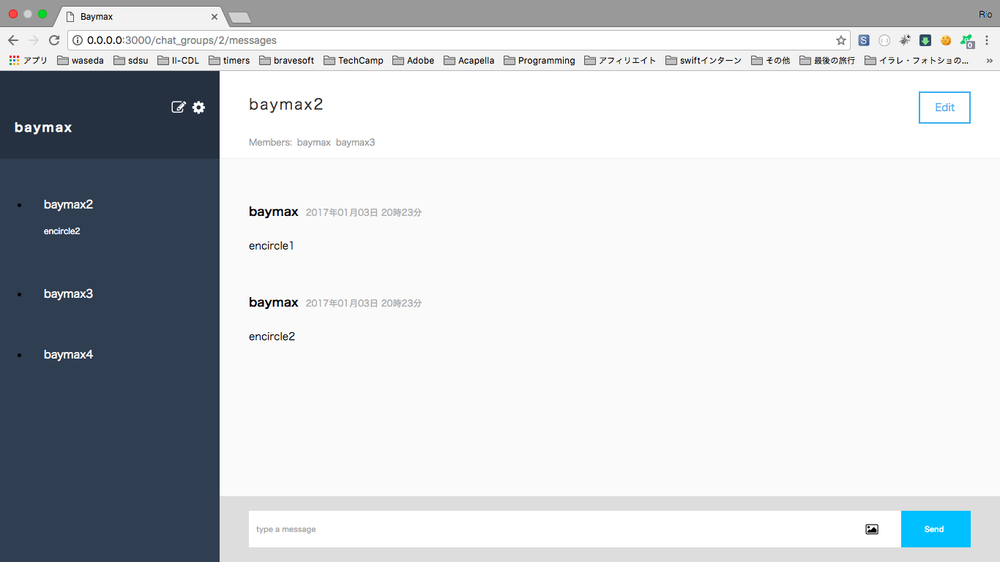
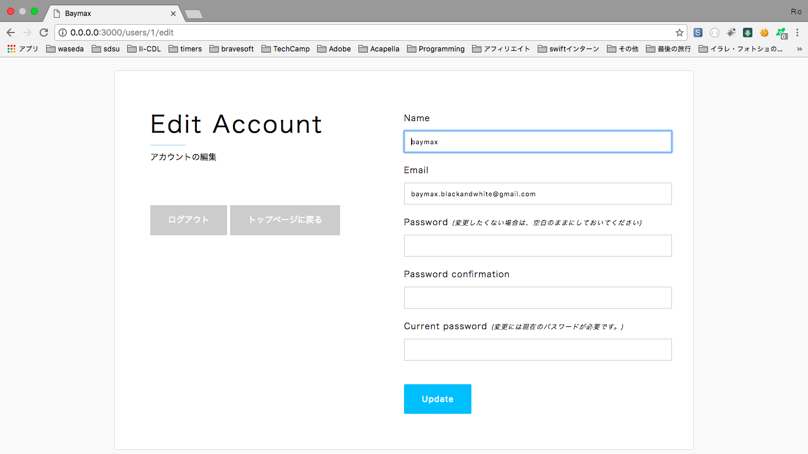

# ChatSpace

A web application built by Ruby on Rails. It provides an environment where registered users can send direct messages, make groups with whoever preferred, and make chats just like twitter or facebook.





## Installation
```
$ git clone git@github.com:r-ume/chatspace.git
$ bundle install --path vendor/bundle
$ bundle exec rake db:create
$ bundle exec rake db:migrate
$ bundle exec rake db:seed:sub_fundamentals
$ bundle exec rails s
```

## Development in Local Environment
```
// Execute the both commands below, but on a different tab on your console.
$ bundle exec rails s
$ bundle exec webpack-dev-server
```

## User Table
  - email
  - encrypted_password
  - name

## Message Table
  - body
  - chat_group_id
  - user_id
  - image
  
## ChatGroup Table
  - name

## ChatGroupUser Table
  - chat_group_id
  - user_id

# Associations

- users has_many: :chat_group_users :chat_groups through: :chat_group_users, :messages 

- messages belong_to: :chat_group, :user

- chatgroups has_many: :chat_group_users, :users through: :chat_group_users, :messages

- chatgroupsusers belongs_to: :chat_group, :user

