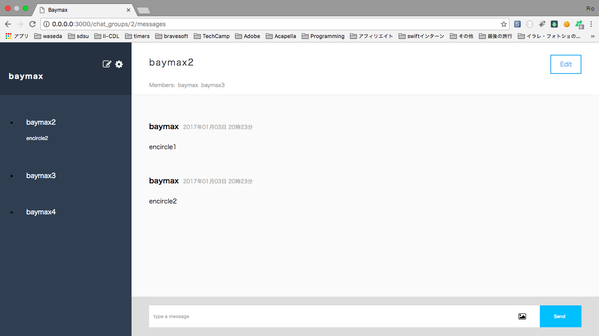
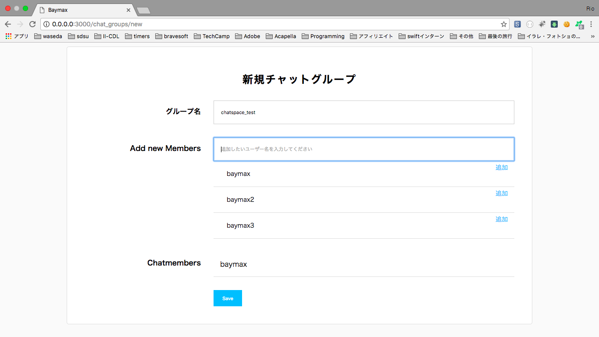
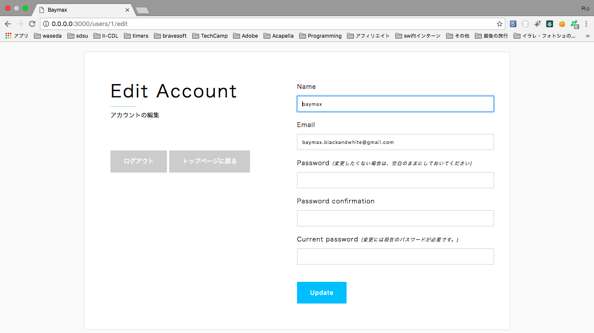

# ChatSpace

A web application built by Ruby on Rails. It provides an environment where registered users can send direct messages, make groups with whoever preferred, and make chats just like twitter or facebook.

## User Table
  - email
  - encrypted_password
  - name

## Message Table
  - body
  - chat_group_id
  - user_id
  - image
  
## ChatGroup Table
  - name

## ChatGroupUser Table
  - chat_group_id
  - user_id

# Associations

- users has_many: :chat_group_users :chat_groups through: :chat_group_users, :messages 

- messages belong_to: :chat_group, :user

- chatgroups has_many: :chat_group_users, :users through: :chat_group_users, :messages

- chatgroupsusers belongs_to: :chat_group, :user

